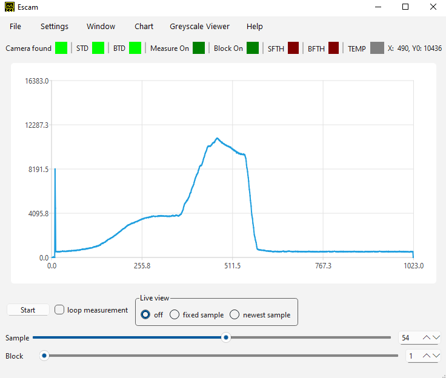

# EBST_CAM
This repository contains software for operating the line scan cameras of [Entwicklungsbüro Stresing](http://stresing.de). There are multiple projects for different plattforms. This readme is giving an overview of these projects and contains instructions for compiling. If you are looking for more documentation about the software, look [here](https://entwicklungsburo-stresing.github.io/). Also refer to your given manual FLbook.pdf for more documentation.

project			| description																		| plattform
:---			| :---																				| :---
CsimpleExample	| simple CLI example in C															| Windows, Linux
doc				| documentation with [Doxygen](https://www.doxygen.nl/) of the library API and more	| Windows, Linux
escam			| cross plattform [Qt](https://www.qt.io/) GUI written in C++						| Windows, Linux
escam_deb		| script to create a .deb package													| Linux
escam_setup		| [Microsoft Visual Studio Installer Project](https://marketplace.visualstudio.com/items?itemName=VisualStudioClient.MicrosoftVisualStudio2017InstallerProjects) to create a setup for escam | Windows
ESLSCDLL		| software library .dll / .so														| Windows, Linux
hdf				| library for exporting data to [hdf5](https://www.hdfgroup.org/solutions/hdf5/)	| Windows
Jungo			| library for using the Windows Driver												| Windows
linux-driver	| Linux driver																		| Linux
shared_src		| shared source files for escam, ESLSCDLL, CsimpleExample							| Windows, Linux

## License
The software library ESLSCDLL and the GUI Escam are released under the [LPGL-3.0](https://www.gnu.org/licenses/lgpl-3.0.html.en). This applies for files in `escam/`, `ESLSCDLL/`, `linux-driver/userspace/` and `shared_src/`. The Linux Kernel object and its source code in `linux-driver/kernelspace/` is released under the [GPL-2.0](https://www.gnu.org/licenses/old-licenses/gpl-2.0.html.en). The CLI C example `CsimpleExample/` is released as public domain under the [Unlicense](https://unlicense.org/).

## Disclaimer for Critical Applications

As we use Xilinx/AMD FPGAs in all our hardware, we copy here the disclaimer from Xilinx/AMD, which apply for all our products.

Xilinx products are not designed or intended to be fail-safe, or for use in any application requiring fail-safe performance, such as life-support or safety devices or systems, Class III medical devices, nuclear facilities, applications related to the deployment of airbags, or any other applications that could lead to death, personal injury, or severe property or environmental damage (individually and collectively, "Critical Applications"). Customer assumes the sole risk and liability of any use of Xilinx products in Critical Applications, subject only to applicable laws and regulations governing limitations on product liability.

## Escam


## Windows

### Build Dependencies
* [Visual Studio](https://visualstudio.microsoft.com/) with C++ Toolbox (Plattform Toolset: v143, Windows SDK Version: 10.0.18362.0).
* Visual Studio Extention: [Qt Visual Studio Tools](https://marketplace.visualstudio.com/items?itemName=TheQtCompany.QtVisualStudioTools2019) + [MSVC Qt 6.8](https://www.qt.io/download) (both needed for Escam)
* Labview Libraries: Optional, for DLL usage with Labview. If you want to compile the DLL for usage with other software than Labview, set compile options "Debug" and "Release" instead of "Debug-Labview" and "Release-Labview".
* Visual Studio Extention: [Microsoft Visual Studio Installer Project](https://marketplace.visualstudio.com/items?itemName=VisualStudioClient.MicrosoftVisualStudio2017InstallerProjects) (optional, for creating setup.exe for escam)

### Compile
Open `EBST_CAM.sln` with Visual Studio and press build. There are different compiling configurations available. There is a build script to build all: `makeall.ps1`.

configuration	| description
:---			| :---
Debug			| Debug build for escam, DLL and CsimpleExample.
Debug_minimal	| Debug build for escam and CsimpleExample and minimal debug build for DLL.
Debug-Labview	| Debug build for DLL with Labview libriaries for communication with Labview software.
Release			| Release build for escam, DLL and CsimpleExample. Use this for production usage for escam and for DLL usage with Python, Matlab or other usage.
Release_minimal	| Release build for escam and CsimpleExample and minimal release build for DLL. Use this for production usage for escam and for DLL usage with Python, Matlab or other usage when you don't need additional functions like the greyscale viewer, hdf5, math functions or other additional appearing windows.
Release-Labview	| Release build for DLL with Labview libraries for communication with Labview software. Use this for production usage with Labview.

### Installing Windows driver
Run `install_run_as_admin.bat` from [Stresing14.00_Driver_Distribution_Package](http://stresing.de/dwnl/ebstdrv14v00.rar) as admin. 

### Installing escam
Compile solution first and use `escam_setup/build/setup.exe` or use `setup.exe` from a [release](https://github.com/Entwicklungsburo-Stresing/EBST_CAM/releases). If Microsoft Visual C++ Redistributable is missing, this setup should install it automatically.

### Using ESLSCDLL.dll
For the use of `ESLSCDLL.dll` [Microsoft Visual C++ Redistributable](https://aka.ms/vs/16/release/vc_redist.x64.exe) must be installed. If the DLL wasn`t compiled with a minimal configuration, it is depending on hdf5.dll.

### Troubleshooting
If `MSVCP140.dll` and `VCRUNTIME140.dll` are missing, Microsoft Visual C++ Redistributable is not installed. [Install](https://aka.ms/vs/16/release/vc_redist.x64.exe) it.

## Linux

### Build Dependencies
* Qt 5.15 - 6.8 (for escam Qt GUI)
* make
* C++ compiler g++
* libqt5charts5-dev
* Linux Kernel 5.4 - 6.8
* HDF5
```
sudo apt install qt5-default qt5-qmake g++ libqt5charts5-dev make libhdf5-dev
```

### Run Dependencies
* libqt5charts5
```
sudo apt install libqt5charts
```

### Compiling

There is a top level `Makefile` to build everything. Just type `make`.

#### Debugging
example launch.json for vscode:
```
{
	"version": "0.2.0",
	"configurations": [
		{
			"name": "Debug escam",
			"type": "cppdbg",
			"request": "launch",
			"program": "${workspaceFolder}/escam/build/escam", // Replace with the path to your executable
			"args": [], // Add any arguments your program needs
			"stopAtEntry": false,
			"cwd": "${workspaceFolder}",
			"environment": [
				{
					"name": "LD_LIBRARY_PATH",
					"value": "${workspaceFolder}/ESLSCDLL/:${env:LD_LIBRARY_PATH}"
				}
			],
			"externalConsole": false,
			"MIMode": "gdb",
			"setupCommands": [
				{
					"description": "Enable pretty-printing for gdb",
					"text": "-enable-pretty-printing",
					"ignoreFailures": true
				}
			],
			"preLaunchTask": "build", // Ensure you have a corresponding task in tasks.json
			"miDebuggerPath": "/usr/bin/gdb", // Path to gdb
			"logging": {
				"engineLogging": true
			},
			"launchCompleteCommand": "exec-run",
			"internalConsoleOptions": "openOnSessionStart"
		}
	]
}
```
example tasks.json vor vscode:
```
{
	"version": "2.0.0",
	"tasks": [
		{
			"label": "build",
			"type": "shell",
			"command": "make",
			"args": [],
			"group": {
				"kind": "build",
				"isDefault": true
			},
			"problemMatcher": ["$gcc"],
			"detail": "Task to build the project using make."
		}
	]
}
```


#### Compile Escam
Two possibilities:
1. Open escam.pro with [Qt Creator](https://www.qt.io/product/development-tools) and press build.
2. Or run in Terminal:
```
cd escam
qmake
make
```
#### Compile kernel module
```
cd linux-driver/kernelspace/
make
```

### Installing driver and escam
Use a .deb from [release](https://github.com/Entwicklungsburo-Stresing/EBST_CAM/releases) or create your own. Before running the script `create_escam_deb.sh` you need to compile escam.
```
cd escam_deb
./create_escam_deb.sh

# install e.g. for version 3.20.3
sudo apt install ./escam_3.20-3.deb
```

### Running escam
```
escam
```
