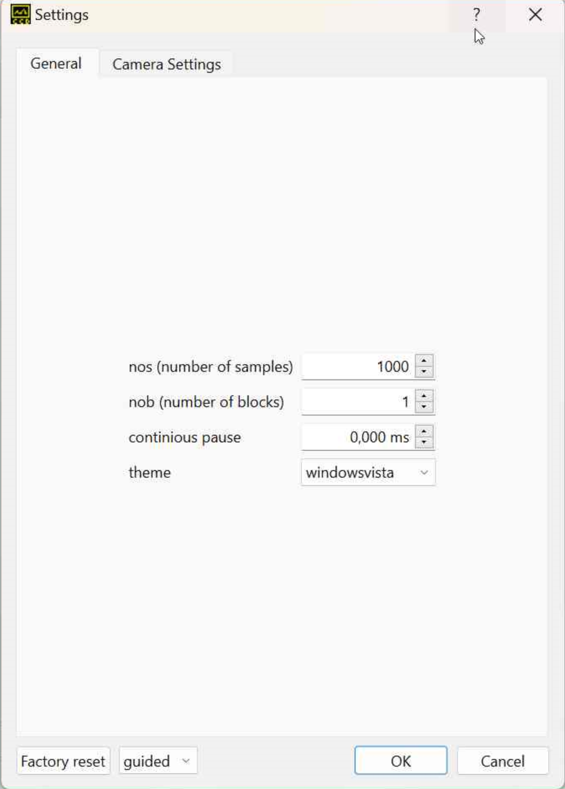

# Entwicklungsbuero Stresing software documentation

This documentation is about the [software](https://github.com/Entwicklungsburo-Stresing) for operating the specialized line scan cameras of [Entwicklungsbuero Stresing](https://stresing.de). For instructions about compiling have a look at the readme in the [EBST_CAM](https://github.com/Entwicklungsburo-Stresing/EBST_CAM) repository. For more detailed information about your camera refer to your given manual FLbook.pdf.

## How to use Stresing software

Use the compiled library ESLSCDLL.dll or libESLSCDLL.so and operate the camera from your software with DLL calls. There are several examples available that are operating the camera with the DLL for [LabVIEW](https://github.com/Entwicklungsburo-Stresing/lv64), [Python](https://github.com/Entwicklungsburo-Stresing/stresing_python), [Matlab](https://github.com/Entwicklungsburo-Stresing/stresing_matlab) and C. Additionally there is a fully featured GUI called Escam, written in C++ with Qt. Escam and the C example CsimpleExample are located in the [EBST_CAM](https://github.com/Entwicklungsburo-Stresing/EBST_CAM) repository.

Have a look at the block diagrams at the bottom of this page to get an overview of the software structure.

## How to operate Stresing cameras

For a simple measurement the following DLL calls should be used. For a complete API documentation go to the DLL documentation [page](_e_s_l_s_c_d_l_l_8c.html).

1. [DLLInitDriver](@ref DLLInitDriver): Initialize the driver. Call it once at startup. 
2. [DLLInitBoard](@ref DLLInitBoard): Initialize PCIe board. Call it once at startup.
3. [DLLSetGlobalSettings](@ref DLLSetGlobalSettings) or [DLLSetGlobalSettings_matlab](@ref DLLSetGlobalSettings_matlab): Set settings parameter according to your camera system. Call it once at startup and every time you changed settings.
4. [DLLInitMeasurement](@ref DLLInitMeasurement): Initialize Hardware and Software for the Measurement. Call it once at startup and every time you changed settings.
5. [DLLStartMeasurement_blocking](@ref DLLStartMeasurement_blocking) or [DLLStartMeasurement_nonblocking](@ref DLLStartMeasurement_nonblocking): Start the measurement. Call it every time you want to measure.
6. [DLLAbortMeasurement](@ref DLLAbortMeasurement): Use this call, if you want to abort the measurement.
7. [DLLCopyOneSample](@ref DLLCopyOneSample), [DLLCopyAllData](@ref DLLCopyAllData), or [DLLCopyOneBlock](@ref DLLCopyOneBlock): Get the data with one of the following 3 calls. Call it how many times you want.
8. [DLLExitDriver](@ref DLLExitDriver): Before exiting your software, use this call for cleanup.

## How to use escam

### Setting up escam
After opening the program, you will be greeted by the main page. To configure the settings for the camera, open the 'Settings' tab at the top and choose 'Edit' and the 'General' tab of the settings will open. The first time you start the program on your PC, the initial values have to be imported. We have saved your setup in a config.ini file. So import this file at the first start. These values are stored then in windows (registry) and you do not need to import it again.
For many elements in Escam there are additional information available through tooltips and context help. Especially in the settings dialog you can find a detailed description for every parameter in the context help. A tooltip appears after hovering with the cursor over a specific element for some seconds.

The context help can be reached through different methods:

* right clicking on an element and clicking `Whats This?`
* clicking on the `?` button at the top of a window and then on the element of interest
* under `Help` -> `Context help` and then clicking on the element of interest

A small pop up window will appear with a detailed explanation.

## Software structure

## Software structure of Escam

